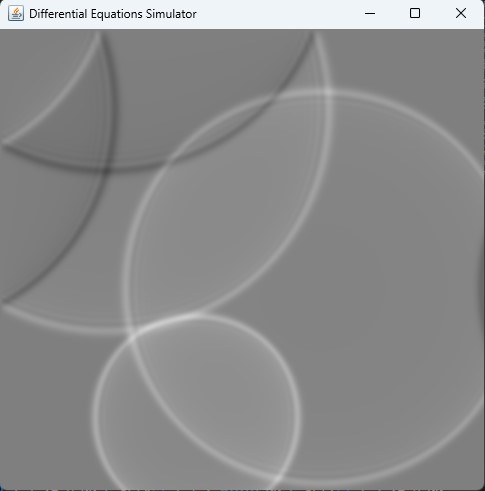

# Java-Differential-Equation-Simulation

プログラミング演習の個人課題です。

2次元の波動方程式:

$$
\frac{\partial^2 u}{\partial t^2} = v^2 \left ( \frac{\partial^2 u}{\partial x^2} + \frac{\partial^2 u}{\partial y^2} \right)
$$

をシミュレーションします。

クリックした箇所に波を発生させます。

   

`app.bat` を実行するとコンパイル/実行されます。